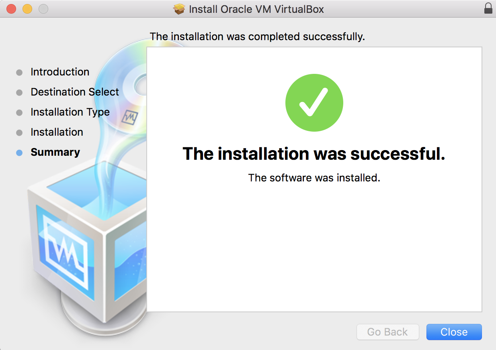
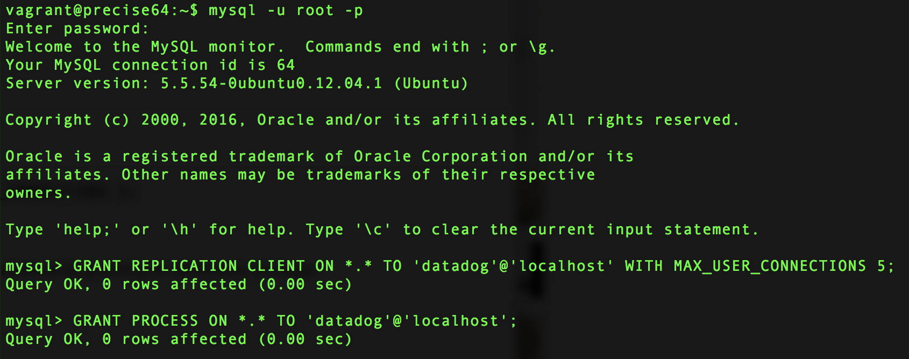

#Tech Writer exercise
##Setup the environment

1. Spinup a fresh linux VM via Vagrant.





2. Sign up for Datadog


3. Get the Agent reporting metrics from your machine.


##Collecting metrics

1. Add tags in the Agent config file and show us a screenshot of your host and its tags on the Host Map page in Datadog.


2. Install a database on your machine (MongoDB, MySQL, or PostgreSQL) and then install the respective Datadog integration for that database.





3. Create a custom Agent check that submits a metric named my_metric with a random value between 0 and 1000.


```python
try:
    # first, try to import the base class from old versions of the Agent...
    from checks import AgentCheck
except ImportError:
    # ...if the above failed, the check is running in Agent version 6 or later
    from datadog_checks.checks import AgentCheck

	# content of the special variable __version__ will be shown in the Agent status page
__version__ = "1.0.0"

import random

class MyMetricCheck(AgentCheck):
    def check(self, instance):
        self.gauge('my_metric', random.randint(0,1000), tags=[])
```

4. Change your check's collection interval so that it only submits the metric once every 45 seconds.

```yml
init_config:

instances:
  - min_collection_interval: 45

```

5. *Bonus Question* Can you change the collection interval without modifying the Python check file you created?

##Visualizing data

1. Utilize the Datadog API to create a Timeboard that contains:

* Your custom metric scoped over your host.

* Any metric from the Integration on your Database with the anomaly function applied.

```json
{
  "title": "my_metric_dashboard",
  "widgets": [
    {
      "definition":{
        "type": "timeseries",
        "requests":[{"q": "avg:my_metric{host:maria-ubuntu}"}]
      }
    },
    {
      "definition":{
        "type": "timeseries",
        "requests":[{"q": "anomalies(avg:mysql.innodb.mem_total{host:maria-ubuntu}, 'basic', 2)"}]
      }
    }
  ],
  "layout_type": "ordered",
  "description": "The dashboard I have to do for the exercise"
}

```


2. Once this is created, access the Dashboard from your Dashboard List in the UI:


* Set the Timeboard's timeframe to the past 5 minutes.

Note: We spoked over email and you changed the time to 15 min.


* Take a snapshot of this graph and use the @ notation to send it to yourself.


* Bonus Question: What is the Anomaly graph displaying?