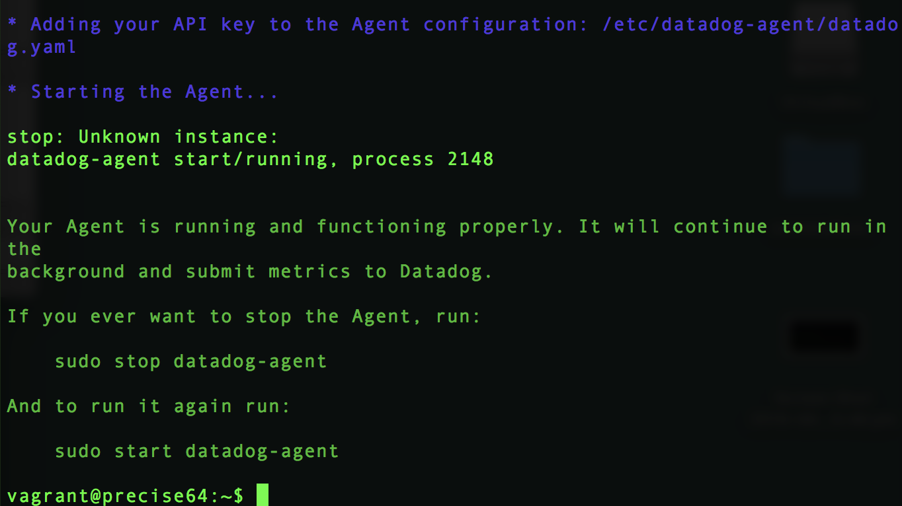

# Tech Writer exercise
## Prerequisites - Setup the environment

I chose the recommended approach of spinning up a fresh linux VM via Vagrant. These are the steps I followed:

1. Spin up a fresh linux VM via Vagrant.

	

	

	

	

2. Sign up for Datadog

	

3. Get the Agent reporting metrics from your machine.

	

	

	

	

	

## Collecting metrics

1. Add tags in the Agent config file at `/etc/datadog-agent/datadog.yaml` and show us a screenshot of your host and its tags on the Host Map page in Datadog.

	

	

2. Install a database on your machine (MongoDB, MySQL, or PostgreSQL) and then, install the respective Datadog integration for that database.

	

	
	
	_Note: The Message "No data for 1d 10h" is due to my personal computer being offline during that time._
	

	

	

	

3. Create a custom Agent check that submits a metric named my_metric with a random value between 0 and 1000.

	The python check file `/etc/datadog-agent/checks.d/my_metric.py`:

	```python
	try:
	    # first, try to import the base class from old versions of the Agent...
	    from checks import AgentCheck
	except ImportError:
	    # ...if the above failed, the check is running in Agent version 6 or later
	    from datadog_checks.checks import AgentCheck
	
		# content of the special variable __version__ will be shown in the Agent status page
	__version__ = "1.0.0"
	
	import random
	
	class MyMetricCheck(AgentCheck):
	    def check(self, instance):
	        self.gauge('my_metric', random.randint(0,1000), tags=[])
	```
	
	The check configuration file `/etc/datadog-agent/conf.d/my_metric.yaml`:

	```YAML
	instances: [{}]	
	```


4. Change your check's collection interval so that it only submits the metric once every 45 seconds.

	The check configuration file `/etc/datadog-agent/conf.d/my_metric.yaml` after the change:

	```YAML
	init_config:
	
	instances:
	  - min_collection_interval: 45
	
	```
	In the following image you can see the difference between the default 15 seconds and once I changed it to 45 seconds.	
	
	_Note: there is a gap of about 1 hour and 15 minutes due to the agent being down and not sending metrics_


5. *Bonus Question* Can you change the collection interval without modifying the Python check file you created?
	
	**Answer**: Yes it is possible. In fact, it was my first approach. I could have modified the code to call gauge once every three times the check method was called by the agent (15secs * 3 = 45 secs). Instead I thought it would be more natural to just use the check configuration.

## Visualizing data

1. Utilize the Datadog API to create a Timeboard that contains:

	* Your custom metric scoped over your host.

	* Any metric from the Integration on your Database with the anomaly function applied.

	Here I chose to use `curl` as it was quicker. 
	
	1.1. This was my curl request after I exported the variables `app_key` and `api_key` to the shell:

	```Shell
	curl -X POST "https://api.datadoghq.com/api/v1/dashboard?api_key=${api_key}&application_key=${app_key}" -i -H "Content-type: application/json" -d @dashboard.json
	```
		

	1.2 This was the content of my `dashboard.json` file containing the request body:

	```json
	{
	  "title": "my_metric_dashboard",
	  "widgets": [
	    {
	      "definition":{
	        "type": "timeseries",
	        "requests":[{"q": "avg:my_metric{host:maria-ubuntu}"}]
	      }
	    },
	    {
	      "definition":{
	        "type": "timeseries",
	        "requests":[{"q": "anomalies(avg:mysql.innodb.mem_total{host:maria-ubuntu}, 'basic', 2)"}]
	      }
	    }
	  ],
	  "layout_type": "ordered",
	  "description": "The dashboard I have to do for the exercise"
	}
	
	```
	_Note: both the dashboard.json file and a little shell script to run curl can be found in the folder [scripts] (./scripts)_
	
	1.3. The result of my command:
	
	

	1.4. Metrics shown in my Dashboard. On the left the random metric, and on the right mysql average memory usage (flat as the DB was not in actual use).

	

2. Once this is created, access the Dashboard from your Dashboard List in the UI:


	* Set the Timeboard's timeframe to the past 5 minutes.
	
		_Note: We spoked over email and you changed the time to 15 min._	
	* Take a snapshot of this graph and use the @ notation to send it to yourself.
	
		
	
	* Bonus Question: What is the Anomaly graph displaying?
		It is showing the historical trend together with the actual data for the selected period. However, given that the metric has been always on the same value, we can only see a line, as both the trend and the actual data are exacly the same.
	